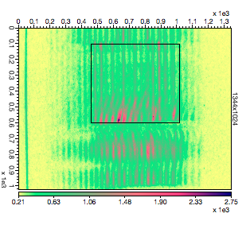
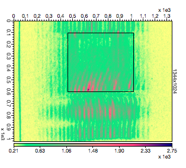

VISAR ghost fringes remove tool
===============================

Sometimes, in shock experiments you get an interference between the
surface you want to measure the velocity (i.e. the shock or a reflective
interface) and a rear window.

In the image below you can see (highlighted by the rectangle) the region
in which the ghost fringes appear. For this image we're not interested
in the vertical fringes but we want to highlight the "moving ones" i.e.
the real signal that has been partially hided by the ghosts.

In this case you can use the **GhostFringes** window
under **Analysis** Menu.

Open the reference and the shot image and set appropriately the
combo-boxes.

You need to provide the interfringe and the rest angle orientation of
the ghost fringes. Alternatively you can hit the button  
(if this can't find the good interfringe you can
either change the "weight" spinbox or select a different region). Pay
attention that the angle is 0˚ (or 180˚) for vertical fringes and 90˚
(or -90˚) for horizontal fringes.

Hit the **Calculate** button and you will see your ghost fringes disappear 
and enhance your signal fringes. You can see below the filtered image.

Now you can proceed and analyze the visar image with the
**VISAR** tool.
