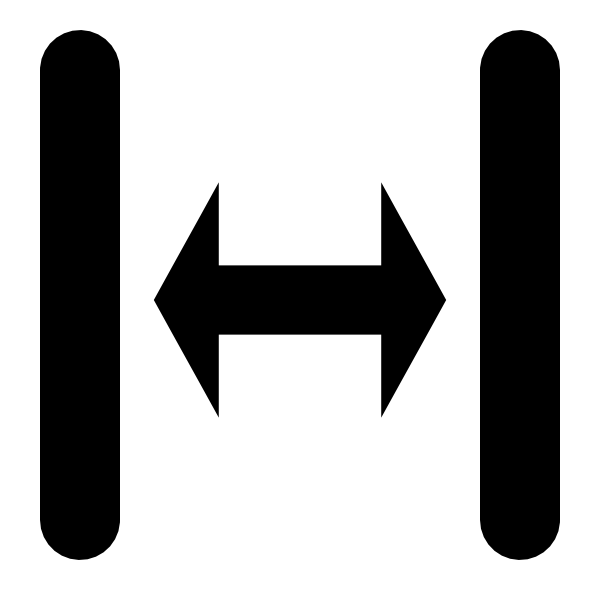
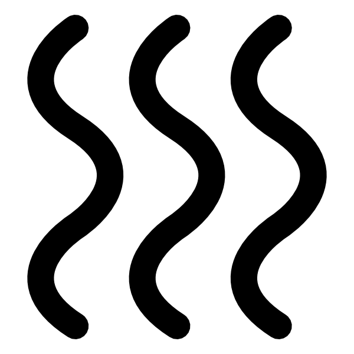

In the Window there are 3 main tabs on the left : *Settings*, *Velocity* and
*SOP*

In the main toolbar you can add  more visars or remove if there are too many 

The main tabs on the laft are *Settings* (for parameters that you just have to change once) and *Velocity* (to tune the velocity measurements (e.g. jumps and delays)

Settings :
==========

For each *Visar* tab to set the parameters:

  * Select the *Reference* and the *Shot* images
  * Choose *Deghost* to activate the region in which remove ghost fringes. The checkbox is a bit "special" since it ca have three valus: unchecked (no ghost fringes), checked (ghost fringes will be removed) and patially checked (will remove ghost fringes and will show the processed image)
  * With your mouse, select the ROI in the main window (the phase is taken from the middle
    of the ROI, while the intensity is averaged over the entire ROI)
  * Get the *Carrier* (orientation and interfringe): hit on the button 
    (adjusting the *weight* if the values are not correct, to remove
    either the lower frequencies or the higher frequencies)    
  * set the *Center*, *Magnifgication* if you want to have absolute space references
  * set the *Slit* parameter (in px) is corresponding to the
    width of the Gaussian part of the Morlet function in the direction
    of the fringes, i.e. the time direction (this might weel reasonably be the height of the slit when the streak camera is in focus mode).
  * Fit the interference fringes by hitting 
  * Adjust the *intensity parameters*: 
  
      * adjust the background *offset* (background noise level). To estimate its value, read on the image directly on an appropriate area (long time after the shock for example or on the side where fringes are usually not present).
      * adjust the *Pixel delay* between the reference and the shot (in case of probe jitter).
      * adjust the *ref* (Refence multiplication factor) to have the blue curves: ref (dashed line) and the shot (full line), at the same level (to correct from the shot-to-shot fluctuations of the probe laser energy). This in mandatory for the reflectivity measurement.
      * The sensitivity (Velocity/fringe). In the **Notes** tab you can find a simple sensitivity calculator based on the etalon parameters (thickness, wavelength, refractive index and delta correction for refractive index)      
      * **Sweep Time** is the temporal calibration of the streak camera. The is a list of values ($A_1$ ... $A_n$) as defined by th Hamamatsu cameras (i.e $T(X)=A_1x+A_2 X^2 /2+A_3 X^3 /3+...+A_n X^n /n$). One value is linear response.

Velocity:
=========

For each *Visar* tab to set the velocity parameters:

  * Specify the 
    o *Delay* of the shot to the initial synchronization shot 
    o *t0* Pixel position of the synchronization
  * The *Offset* is for a fine adjustment of the fringe position between the reference and the shot. This is adjusted automatically. The automatic value is displayed. If needed (when the value of the velocity at negative time is not at 0), an additional offset can be set manually.
  * The *Reflectivity* window allows to precise the real value of the reflectivity.
     o *material* To set the real value of the reflectivity of the used material
     o *ghost* In case you have a windows patially reflecting in front of the shock
  * *Jumps* To correct the jumps of fringes In case of a jump, both Visars won’t have the same velocity. Here the objective is to apply a
    correction and obtain the 2 same velocities:
    
     * Three parameters need to be adjusted and:
         1. t = time for the beginning of the velocity change (in pixel).
         2. i = number of jumps to correct for (defined by step 6.1)
         3. [n0] = index of refraction. This is optional.
     * This set of parameters is set for each jump. As an example "`0 3; 3.5 5 1.7`", means:
         1. a first change of velocity at the time `0` with a jump of `3` fringes (no refractive index means `1`)
         2. a second change of velocity at the time `3.5` with a jump of `5` fringes in a medium with refractive index of `1.7`.

Temperaure:
===========

  *  Select *Reference* and *Shot* images. In case only shot image is present it will use the same on bot combo-box and use the *background* spin-box to adjust the background level
  *  set the pixel *time zero* and the delay *delta t*
  *  set *Center* and *magnification* as explained above.
  *  Choose the *refelectiviy*:
     1. *Vx*: Visar number `x`
     3. *Mean* of all visars at that time
     4. *Zero*: no reflectivity (Blackbody temperature)
  *  **Sweep Time**: conversion px to time (same as above with Hamamatsu polynomial expansion)
  *  Direction: **H**orizontal or **V**ertical
  *  SOP calibration: **$T_0$** and **A** : calibration values ($T_0$ is the color temperature of the light collected by optical system and "A" is the efficiency of the streak).


Shot number change:
===================

In order to be able to swap from one shot to another, it's possible to fill the **Dir** field for each **Visar** (all refs and shots of a Visar are in the same directory) in the *Settings* tab and both *RegEx* pattern for refrence and shot.

The *RegEx* pattern:

Imagine you have all shots like this:

```
Visar_2_001_ref.img
Visar_2_001_shot.img
Visar_2_002_ref.img
Visar_2_002_shot.img
...
Visar_2_051_ref.img
Visar_2_051_shot.img
```

so the **Ref:** *RegEx* will be `Visar_2_(\d+)_ref.img` and **Shot:** will be `Visar_2_(\d+)_ref.img`. 

This is just an example because *RegEx* is really powerful, here the important part is `(\d+)` which will match "one or more digits".

The button  will guess the values for the actual images.

Once this in place, in the top tollbar, you can change the number of the shot in order to close the actual images, open the ref and shot corresponding to the shot number provided on top and filter the images.


