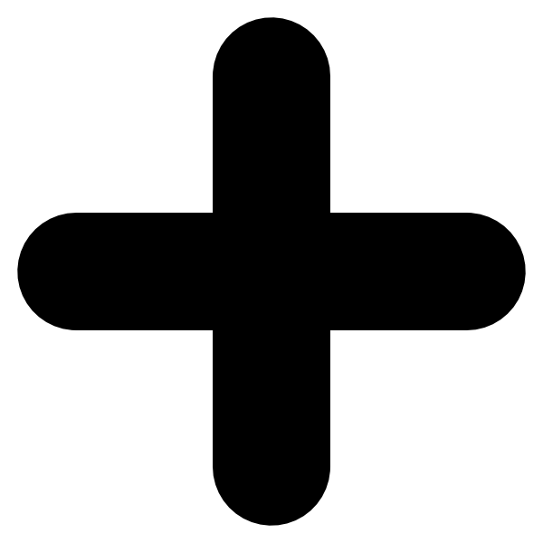
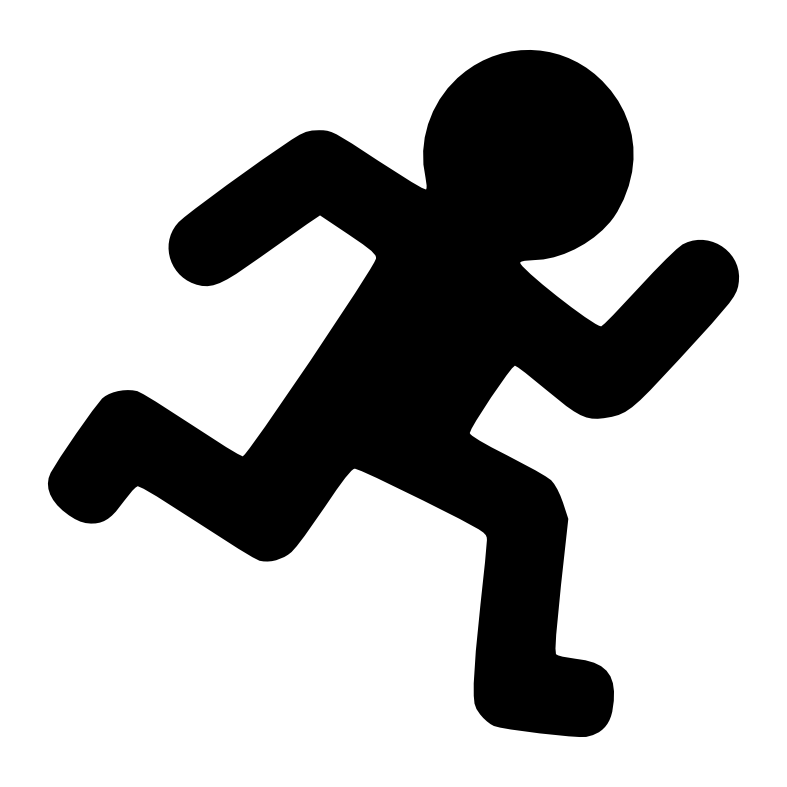
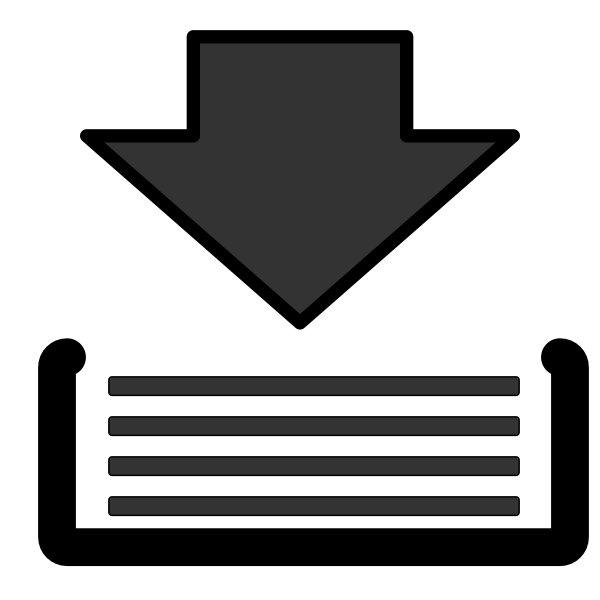

 to add more IP crops 

 to remove the rightmost

 will do all the crops at once

 will remove all the crops

You can change the name of the IP by double clicking on the corresponding tab

 to save all the IPs. Check the box to create a directory containing all images. Each file will have the name of the IP

