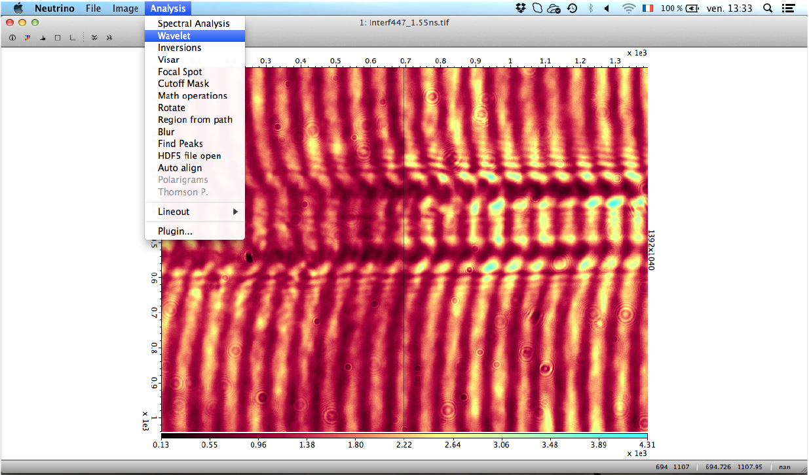
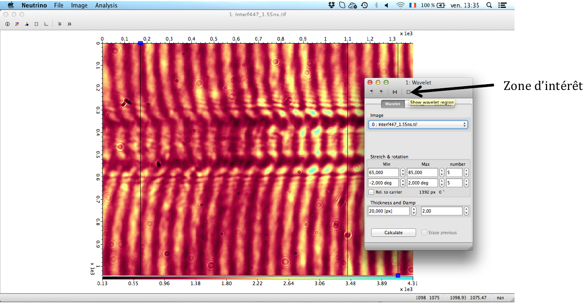
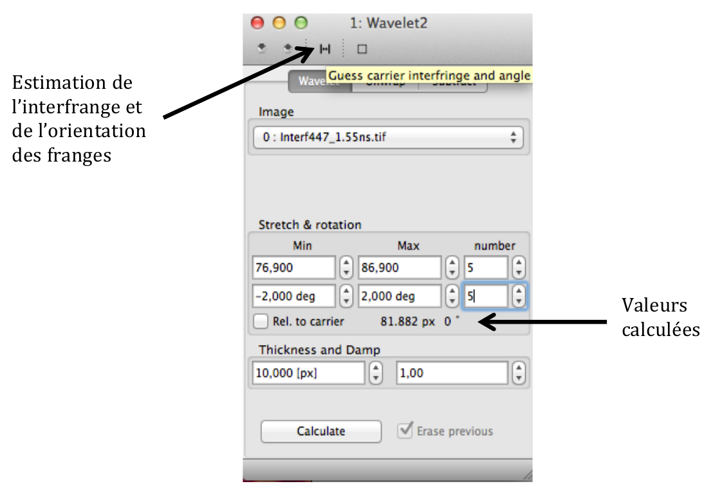
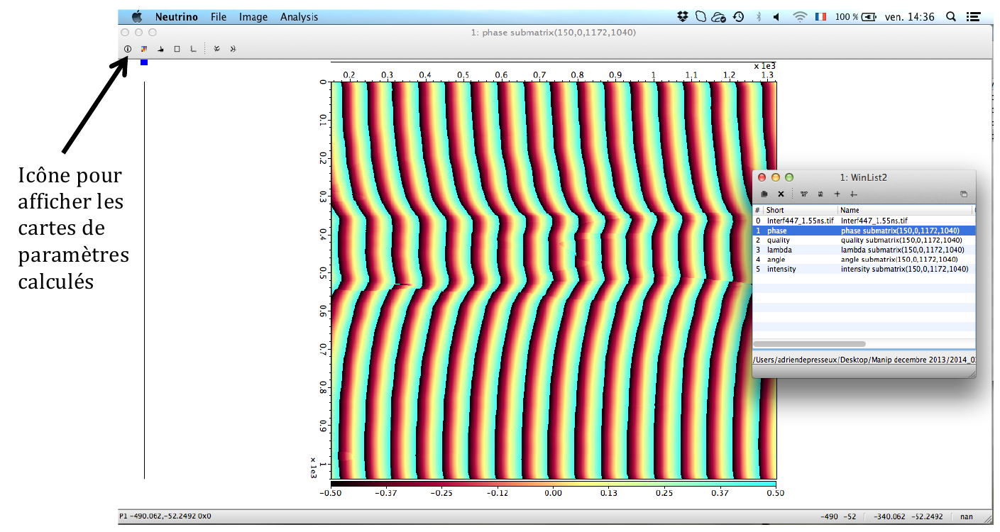
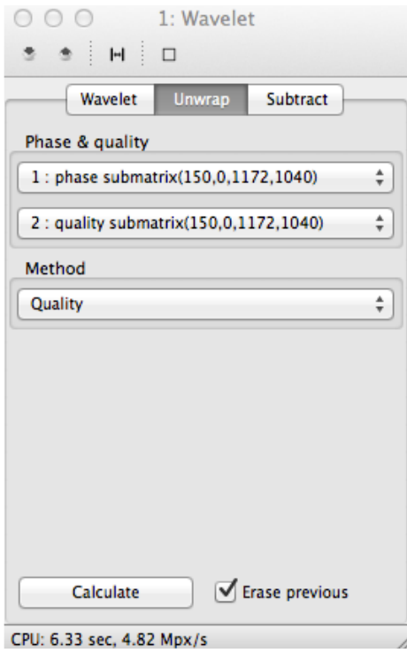
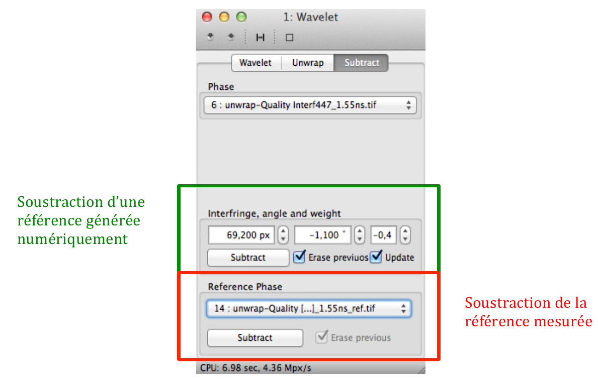
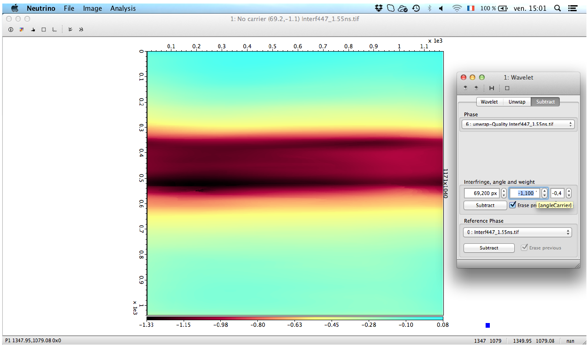
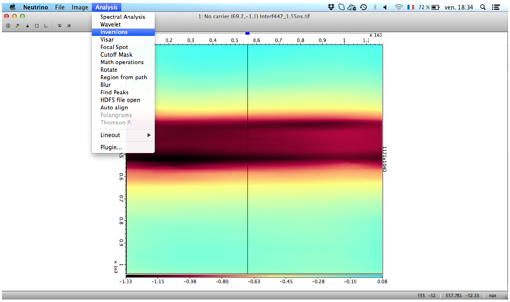
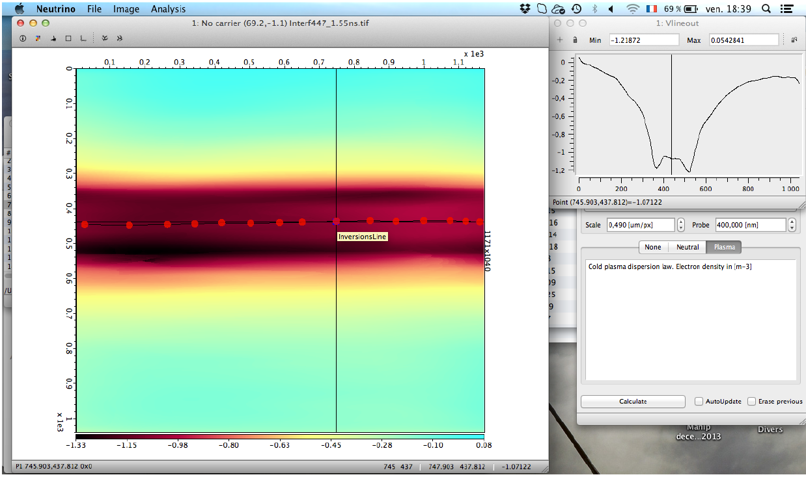
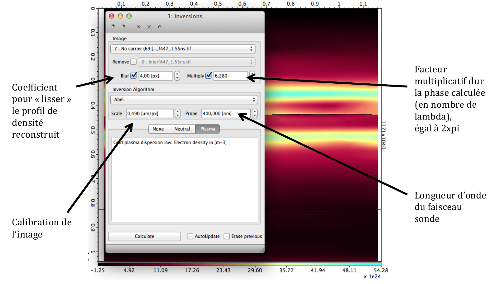

# Traitement des interférogrammes de canal plasma avec Neutrino 

## Réconstruction des franges

1. Ouvrir **Analysis/Wavelet**

2. Cliquer dans la fénêtre **wavelet** sur le carré (*show wavelet region*)

3. Sélectionner tout l’interférogramme avec **fill horizontal** et **fill vertical** ou
une partie soit à la main avec les curseurs soit avec les coordonnées x,y. Il est
mieux de commencer à restreindre la zone à un endroit où la reconstruction
paraît raisonnablement envisageable.

4. Aller dans le menu **Wavelet**. Vérifier que l’image est bien sélectionnée et
appuyer sur le symbole pour estimer l’interfrange et l’orientation des franges.

5. Définir à présent une plage de variation autorisée pour l’interfrange et
l’orientation des franges. Cocher **Rel. to carrier** pour entrer une plage de
valeurs par rapport à l’estimation. Partir d’une plage de valeurs large pour
commencer et ensuite, restreindre l’intervalle à chaque itération pour la
reconstruction des franges.
Commencer le calcul avec un nombre de points (number) modéré (ex. 5) entre
les limites indiquées.

6. La valeur **Thickness** impose la plage sur laquelle un saut de frange peut être
détecté. Une trop petite valeur fera ressortir le *bruit* tandis qu’une trop
grande valeur lissera les gradients raides. La valeur **Damp** contribue à lisser
les discontinuités lors d’un saut de frange. Augmenter la valeur lorsque, après
calcul, les franges ne sont pas *connectées*. Mais une valeur trop
importante lisse le gradient.

7. **Calculate**. Itérer jusqu’à trouver une configuration satisfaisante. La carte de
données de sortie **Phase** donne la reconstruction numérique des franges. Elle
permet d’estimer qualitativement la fidélité de la reconstruction par rapport à
au suivi des franges sur l’interférogramme d’entrée.
Les données de sorties sont accessibles en cliquant sur l’icône *i* en haut et
à l’extrême gauche de la fenêtre du programme. Une fenêtre de dialogue
**Winlist** apparaît.

## Réconstruction de la phase
1. Dans la fenêtre **wavelet**, aller à présent dans **unwrap**. Sélectionner les
données de sortie Phase et Quality (attention à la numérotation des
données !). Méthode : **Quality**. Puis, Calculate.
Effectuer le calcul pour l’image et sa référence. Les donnés apparaissent dans
la **Winlist** sous l’appellation **unwrap**...\\
{:width="40%;" : .center-image}

2. Ensuite, aller dans **substract**. Deux solutions se présentent pour
reconstruire la phase. Soit utiliser la référence expérimentale, soit générer une
référence numérique à partir des estimations (interfrange et orientation des
franges) données par le programme.

Pour la référence générée numériquement, ajuster les valeurs de l’interfrange
et de l’angle d’orientation des franges. Pour le canal plasma, les deux valeurs
sont optimisées en symétrisant le profil de déphasage, respectivement
longitudinal et transverse.

## Calcul de la densité

1. **Ouvrir Analysis/ Inversions**. Sélectionner la carte de phase dont la référence a
été soustraite. Elle est dans la Winlist sous le nom de **no carrier**.

2. Un axe apparaît sur la carte de phase. Placer les points définissant l’axe un à
un afin de définir l’axe de symétrie du profil. La commande « Cmd + V »
permet d’observer la coupe transverse. « Cmd + A » permet de rajouter des
points.

3. Configurer les paramètres suivants :\\

Sélectionner **plasma**, puis **Calculate**. La carte de densité calculée est dans la **Winlist**
sous le nom de **Abel** et illustrée ci-dessus. Les valeurs de densité sont en electrons/m^3.

4. Itérer pour affiner la définition de l'axe de symetrie.

5. Exporter les données sous fichier texte en allant dans **File/Export**.
